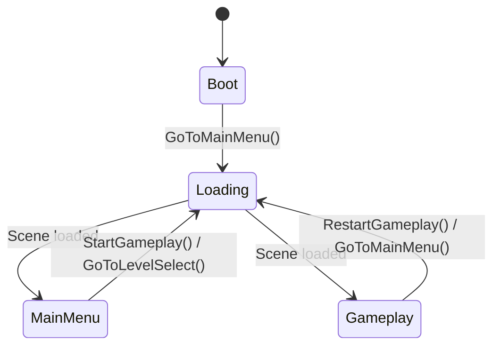

# 🔍 Project Lights Out — Architecture Review (Part 1/3)
## Overview & Core Systems

> This is a 3-part analysis of the `_ProjectLightsOut/Scripts` codebase. This part covers the **directory structure, core patterns, and foundational systems**. Part 2 covers **gameplay systems and specific issues**. Part 3 covers **best practices and concrete refactoring recommendations**.

---

## 1. Directory Structure at a Glance

```
Scripts/
├── DevUtils/                 # Core framework: Singleton, EventManager, AppState, SceneLoader
│   ├── AppManager/           # AppStateManager, SceneLoader, LoadingScreen, SceneLoaderInitializer
│   └── EventSystem/          # EventManager (static pub/sub), GameEvent base class
├── Effects/                  # VFX: Effect (auto-destroy), ShieldEffect
├── Hittable/                 # Damage system
│   └── Enemy/                # Enemy base → Boss, EnemyChanter, EnemyHealer, EnemyShielder
├── Managers/                 # Global singletons
│   ├── AudioManager/         # BGM & SFX with fade in/out
│   ├── CameraManager/        # Shake, pan, zoom, spotting
│   ├── GameManager/          # Game state, pause, time scale
│   ├── LevelManager/         # Wave spawning, level flow, SO data configs
│   │   └── Layout/           # Grid/wall data structs (GridSize, WallBlockData, WallEdgeData)
│   └── ScoreManager/         # Score tracking, bonuses, rollback
├── Player/                   # PlayerShoot, PlayerMove, PlayerSpriteHandler
├── ProceduralLogic/          # PCG system for thesis
│   ├── CSP/                  # Constraint Satisfaction for enemy placement
│   ├── Models/               # Data classes: EnemySpawnData, SpecularPathData, TrajectoryPoint
│   ├── Orchestrator/         # ProceduralEnemySpawner (coordinates path + CSP)
│   └── PathGeneration/       # SpecularPathGenerator (ricochet simulation)
├── Projectiles/              # Projectile, AfterImage, BossBuffThread, ChantThread
└── UI/                       # UI layer
    ├── HUD/                  # Boss health bar, chant bar, bullets, reload, score
    ├── Menu/                 # GameOver, MainMenu, Title, TotalScoreCounter
    └── Pause/                # PauseMenu
```

| Metric | Count |
|---|---|
| Total C# files | ~37 |
| Total LOC (approx.) | ~3,500 |
| Namespaces used | 5 (`ProjectLightsOut.DevUtils`, `.Managers`, `.Gameplay`, `.Effects`, `.UI`, `DamnedVeil.ProceduralLogic.*`) |
| Event classes | ~30 |
| Singletons | 8 (`AppStateManager`, `LoadingScreen`, `AudioManager`, `CameraManager`, `GameManager`, `LevelManager`, `ScoreManager`, `ProceduralEnemySpawner`) |

---

## 2. Core Architectural Patterns

### 2.1 Singleton Pattern ✅ Generally Good

```csharp
public abstract class Singleton<T> : MonoBehaviour where T : MonoBehaviour
{
    public static T Instance { get; private set; }
    protected virtual void Awake()
    {
        if (Instance != null) { Destroy(gameObject); return; }
        Instance = this as T;
    }
}
```

**What's working:**
- Clean generic implementation, prevents duplicates
- `protected virtual Awake()` allows subclass override
- Consistent usage across all manager classes

**Issues:**
- ⚠️ No `DontDestroyOnLoad` in the base class — each subclass manually calls it (inconsistently). `LevelManager` does NOT call it (correct, it's scene-bound). But this should be an explicit design decision, not an accident.
- ⚠️ Missing `OnDestroy` cleanup — if a duplicate is destroyed, `Instance` could still reference a destroyed object in edge cases.

---

### 2.2 Event System ✅ Smart Design, ⚠️ Some Problems

```csharp
// GameEvent base → concrete events like OnPlaySFX, OnEnemyDead, etc.
public static class EventManager
{
    AddListener<T>(Action<T> evt)
    RemoveListener<T>(Action<T> evt)
    Broadcast(GameEvent evt)
    Clear()
}
```

**What's working:**
- Type-safe, decoupled pub/sub — this is a solid pattern for a small-to-medium Unity game
- No strings for event identification (unlike Unity's SendMessage)
- Clean subscription/unsubscription in `OnEnable`/`OnDisable` lifecycle

**Issues:**

> [!CAUTION]
> **Anonymous lambdas in `OnEnable`/`OnDisable` will NEVER unsubscribe correctly.**

In `GameManager.cs`:
```csharp
// ❌ This creates a NEW delegate instance every time — RemoveListener will not find it
EventManager.AddListener<OnGameOver>(evt => { gameState = GameState.GameOver; });
EventManager.RemoveListener<OnGameOver>(evt => { gameState = GameState.GameOver; });  // DOES NOT MATCH!
```

Similarly in `EnemyChanter.cs` and `EnemyHealer.cs`:
```csharp
// ❌ Anonymous lambda assigned/removed in OnEnable/OnDisable — will leak listeners
OnSpawned += () => { Chant(); };
OnSpawned -= () => { Chant(); };  // Different delegate instance!
```

> [!WARNING]
> **~30 event classes scattered across 6+ files** with no central registry or documentation. 
> As the project grows, it becomes very hard to know "who listens to what" and track event flow.

---

### 2.3 App State & Scene Management ✅ Decent

**Flow:**


**What's working:**
- `AppStateManager` provides a clear, centralized state machine for the app lifecycle
- `SceneLoader` has nice async scene switching with fade transitions
- `SceneLoaderInitializer` allows designer tweaking via Inspector
- Additive scene loading with a persistent base scene — good architectural pattern

**Issues:**
- ⚠️ `async void` methods (`GoToMainMenu`, `StartGameplay`, etc.) — fire-and-forget, **no error handling**. If `SwitchToAsync` throws, the exception silently disappears. These should return `Task` or use try-catch.
- ⚠️ `SceneLoader.SwitchToAsync` uses `Task.Delay` and `Task.Yield` — these do NOT respect `Time.timeScale`. This may cause subtle bugs when paused or time-slowed.
- Minor: `SceneLoaderInitializer.TestFadeInCoroutine` uses `yield return SceneLoader.FadeToBlack(...)` — you can't `yield return` a `Task` in a coroutine. This test method is broken.

---

## 3. Honest Assessment — The Good ✅

| Aspect | Verdict |
|---|---|
| **Folder structure** | Very clean, logical grouping by domain |
| **Namespace usage** | Good — consistent `ProjectLightsOut.*` naming with separate `DamnedVeil.ProceduralLogic.*` for thesis work |
| **Event-driven decoupling** | The event system keeps managers, enemies, UI, and player from directly referencing each other |
| **ScriptableObject data** | `LevelDataSO` and `WaveDataSO` are properly designer-friendly |
| **IHittable interface** | Proper abstraction for anything that can be damaged |
| **ProceduralLogic module** | Well-structured with clear separation (Models → PathGeneration → CSP → Orchestrator). Best-documented part of the codebase with XML comments |
| **Consistent OnEnable/OnDisable** | Almost all classes properly subscribe/unsubscribe (minus lambda issues) |

---

## 4. Honest Assessment — The Concerns ⚠️

### 4.1 `LevelManager` Is a God Object (~303 lines, 9+ event subscriptions)

This class currently handles:
- Enemy tracking (registration, death, counting)
- Projectile tracking
- Wave spawning (both manual and procedural)
- Level start/end flow with camera choreography
- Game over conditions
- Player movement triggers
- Score completion transitions
- Boss-level branching logic

> [!IMPORTANT]
> This is the single biggest risk in your codebase. `LevelManager` has become the dumping ground for all gameplay orchestration. Every new feature will likely need changes here.

### 4.2 `Boss.cs` Does Too Much (~274 lines)

`Boss` is simultaneously:
- An enemy with health/damage
- A wave spawner (manages its own `activeWaves`)
- A state machine (phases, teleportation, stun, ready sequence)
- A listener for 4+ event types
- An event broadcaster

### 4.3 Namespace / Global Scope Inconsistencies

Several classes are declared **without a namespace** (in global scope):
- `ShieldEffect`, `EnemyChanter`, `EnemyHealer`, `EnemyShielder`
- `BossBuffThread`, `ChantThread`, `BuffType` enum, `OnBossBuff` event
- All HUD/UI classes: `HUDBossHealthBar`, `HUDBulletUI`, `HUDReloadUI`, etc.
- `PlayerMove`, `FadeBlackUI`, `GameOverUI`, `MainMenuUIManager`, `TitleUI`, `TotalScoreCounterUI`, `PauseMenu`

Only ~40% of your classes are actually inside a namespace. This creates potential naming collisions and makes the code harder to navigate in larger IDEs.

### 4.4 Mixed Coupling Strategies

Some components use the event system to decouple (good):
```csharp
EventManager.Broadcast(new OnPlaySFX("Cast"));
```

But others have direct references that bypass the event system:
```csharp
// Direct singleton access from UI
AppStateManager.Instance.RestartGameplay(LevelManager.Instance.LevelName);
GameManager.Instance.ResumeGame();
LevelManager.LevelData.IsBossLevel;  // Static accessor
```

**This is not necessarily wrong**, but the lack of a clear rule about when to use events vs. direct access makes the architecture harder to reason about.

---

> **Continued in [Part 2](file:///C:/Users/Arucaden/.gemini/antigravity/brain/2cd4a969-f687-4517-bf2c-e4ff5b1eab3b/architecture_review_part2.md) — Gameplay Systems & Specific Bugs**
