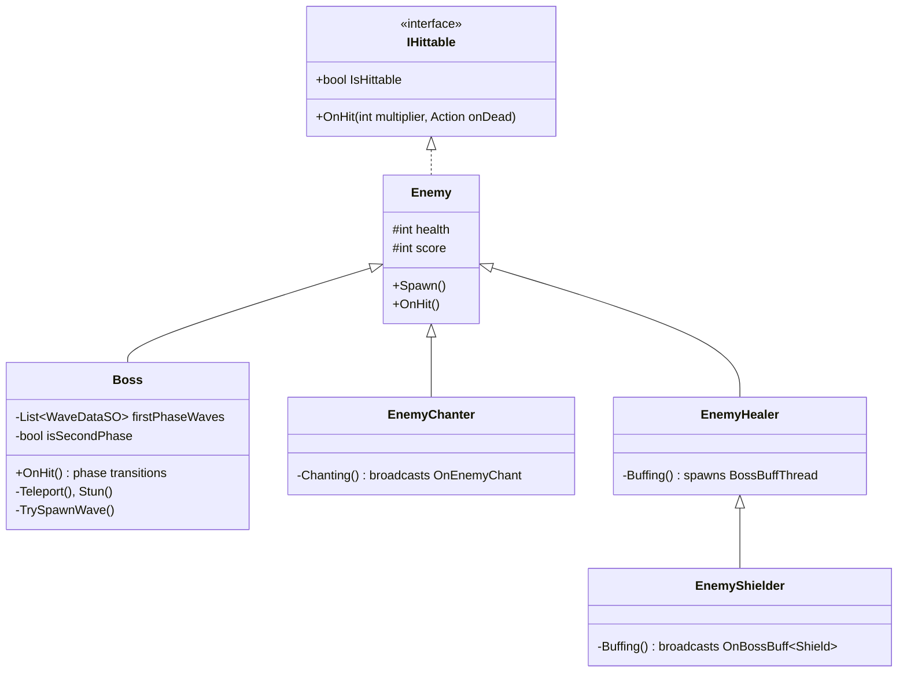
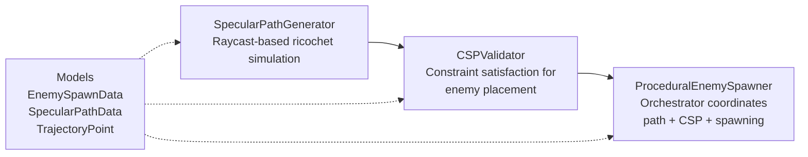

# 🔍 Project Lights Out — Architecture Review (Part 2/3)
## Gameplay Systems & Specific Issues

> Continued from [Part 1](file:///C:/Users/Arucaden/.gemini/antigravity/brain/2cd4a969-f687-4517-bf2c-e4ff5b1eab3b/architecture_review_part1.md)

---

## 5. Gameplay Systems Breakdown

### 5.1 Enemy Hierarchy



**What's working:**
- `IHittable` is a proper interface — any object could implement it
- Inheritance hierarchy makes sense: `EnemyShielder` extends `EnemyHealer` behavior by overriding `Buffing()`
- The `Enemy.Spawn()` method with delayed collider activation is nice

**Issues:**
- `Enemy.cs` has both `OnDamaged` (C# Action) AND broadcasts `OnEnemyDead` (EventManager) — two different coupling strategies on the same class
- `EnemyChanter` and `EnemyHealer` define their event classes (`OnEnemyChant`) in the **same file** outside any namespace — makes them hard to find

---

### 5.2 Player Systems

**Shooting/Aiming System** (262 lines in `PlayerShoot.cs`):
- Dual-ray laser sight with bullet-radius-aware raycasting — clever implementation
- Ricochet preview line showing the first bounce
- Reload system with coroutine-based bullet replenishment
- Boss-level auto-reload when ammo is depleted

**Issues:**
- `PlayerShoot.Start()` wraps data access in a `try-catch (NullReferenceException)` — this is a code smell. It means the code can run without `LevelManager` present, which suggests the dependency isn't well-defined
- Bullets default to 6 both in the field declaration AND the catch block — magic number duplication

**Movement System** (`PlayerMove.cs`, 70 lines):
- Clean waypoint-following system
- Good separation from shooting logic
- `OnPlayerMoving` Action used by `PlayerSpriteHandler` for animation

---

### 5.3 Projectile System

**Core mechanics:**
1. Player fires → `Projectile` flies in direction
2. Hits `Ricochet`-tagged colliders → reflects direction using `Vector2.Reflect`
3. Passes through `IHittable` triggers → calls `OnHit()` with increasing multiplier
4. Each hit increases `maxRicochetCount` — rewarding multi-kills with extra bounces

> [!NOTE]
> This is a unique and well-designed core mechanic. The idea of a projectile that gains extra ricochets by hitting enemies mid-flight creates interesting tactical decisions.

**Issues:**

> [!CAUTION]
> **`ProjectileAfterImageEffect` creates GameObjects that are NEVER destroyed.**

```csharp
private void CreateTrailEffect()
{
    // These empty GameObjects are instantiated but never cleaned up
    GameObject trailEffect = Instantiate(new GameObject(), ...);
    GameObject trailEffectSprite = Instantiate(new GameObject(), ...);
    // No Destroy() call anywhere — memory leak per bullet frame
}
```

This will create **hundreds of orphaned GameObjects** during gameplay. Each spawns every 0.1 seconds per active projectile.

---

### 5.4 ProceduralLogic Pipeline (Thesis Feature)



**This is the best-engineered part of the codebase.** It has:
- Clean separation of concerns (Models → PathGeneration → CSP → Orchestrator)
- Proper XML documentation comments
- Well-defined constraints (safe zones, spacing, min/max counts, path buffers)
- Debug visualization with Gizmos
- Multiple retry attempts with graceful failure

**Minor issues:**
- `ProceduralEnemySpawner` mutates `CSPValidator.MinEnemyCount` directly — should pass params through the `Solve()` method instead
- The `maxAttempts = 100` retry loop could slow down frame rate if called at runtime during gameplay

---

## 6. Specific Bugs & Code Smells

### Bug 1: `Boss.TrySpawnWave()` — Dead Code / Logic Error

```csharp
private void TrySpawnWave()
{
    List<WaveDataSO> waveCache = new List<WaveDataSO>();
    waveCache.RemoveAll(x => activeWaves.Exists(y => y.waveData == x));
    // ↑ waveCache was just created empty — RemoveAll does nothing

    if (waveCache.Count == 0)  // Always true!
    {
        waveCache = firstPhaseWaves;  // Always falls through to this
    }
}
```

The `RemoveAll` on a freshly-created empty list is a no-op. The filter logic was likely intended to operate on `firstPhaseWaves` or `secondPhaseWaves`.

---

### Bug 2: `async void` Fire-and-Forget

In `AppStateManager.cs`, `GameOverUI.cs`, `GameManager.cs`:
```csharp
public async void GoToMainMenu() { ... }
public async void StartGameplay() { ... }
public async void OnRetryButtonClicked() { ... }
```

`async void` methods **swallow exceptions silently**. Any `await` failure disappears. These should either:
- Be `async Task` with proper error handling
- Or use a fire-and-forget utility that at least logs errors

---

### Bug 3: UI Animation Time Scale Inconsistency

Some UI animations use `Time.deltaTime`, others use `Time.unscaledDeltaTime`:
- `HUDBossHealthBar.Retract()` → `Time.unscaledDeltaTime` ✅ (works during pause)
- `HUDScoreUI.Retract()` → `Time.deltaTime` ❌ (freezes during pause)
- `HUDBossWinBar` Update → `Time.unscaledDeltaTime` ✅
- `TotalScoreCounterUI` animations → `Time.deltaTime` (fine, not active during pause)

No consistent rule applied — each UI element made its own decision.

---

### Bug 4: `PauseMenu` + `GameManager` Redundant Time.timeScale

Both `PauseMenu.OnPauseEvent()` AND `GameManager.TogglePause()` set `Time.timeScale`:
```csharp
// GameManager
Time.timeScale = 0f;  // Sets it here
EventManager.Broadcast(new OnPause(isPaused));  // Then broadcasts

// PauseMenu (receives the event)
Time.timeScale = 0f;  // Sets it again
```

Redundant but not harmful — however it shows unclear ownership of the time scale.

---

### Bug 5: `OnPlayerEnableShooting` Is Overloaded

This single event is used for:
1. Enabling/disabling the player's shooting ability
2. Showing/hiding HUD elements (bullets, score, boss health bar)
3. Pausing game logic
4. Boss fight intro sequence

It's a "catch-all" event. If you ever need to hide the HUD without disabling shooting (e.g., a cutscene), you can't.

---

### Bug 6: `HUDBossWinBar` Duplicate Listener Registration

```csharp
private void OnEnable()
{
    EventManager.AddListener<OnPlayerEnableShooting>(OnPlayerEnableShooting);
    EventManager.AddListener<OnEnemyChant>(OnEnemyChant);
    EventManager.AddListener<OnPlayerEnableShooting>(OnPlayerEnableShooting); // ← DUPLICATE
}
```

`OnPlayerEnableShooting` is registered twice, but the `EventManager.AddListener` implementation has a `ContainsKey` check on the delegate, so the second call is silently ignored. Not a crash, but sloppy.

---

> **Continued in [Part 3](file:///C:/Users/Arucaden/.gemini/antigravity/brain/2cd4a969-f687-4517-bf2c-e4ff5b1eab3b/architecture_review_part3.md) — Best Practices & Refactoring Recommendations**
